# Week 4 – Architecture Diagram

Represents the Kubernetes resources evidenced in the Week 4 screenshots and manifests, on a single-node Docker Desktop cluster.

```mermaid
flowchart TB
    subgraph Cluster["Docker Desktop Kubernetes Cluster (desktop-control-plane)"]

        subgraph IngressNS["namespace: ingress-nginx"]
            IC["ingress-nginx-controller\n(Deployment, 1 replica)"]
        end

        subgraph DefaultNS["namespace: default"]

            subgraph Standalone["Standalone Pods"]
                P1["nginx-pod\n(created/inspected/deleted - Day 1)"]
                CSP["config-secret-pod\n(consumes ConfigMap + Secret)"]
                SP["storage-pod\n(mounts PVC)"]
                PD["probe-demo\n(readiness + liveness probes)"]
            end

            subgraph Deployments["Deployments"]
                D1["nginx-deployment\n(scaled 3 to 5, rolling update to nginx:1.27)"]
                D2["nginx2\n(2 replicas)"]
                D3["resource-demo\n(CPU/memory requests+limits)"]
                D4["my-nginx\n(Helm: bitnami/nginx)"]
                D5["my-custom-app\n(Helm: custom 'mychart', revision 1 to 2)"]
            end

            SVC1["nginx-deployment Service\n(NodePort :30777 to 80)"]
            SVC2["nginx-service\n(ClusterIP to nginx-deployment)"]
            SVC3["nginx2-service\n(ClusterIP to nginx2)"]
            SVC4["my-nginx Service\n(LoadBalancer, pending external IP)"]

            CM["ConfigMap: app-config\n(APP_NAME, APP_ENV, APP_VERSION)"]
            SEC["Secret: app-secret\n(username, password)"]
            PV["PersistentVolume: app-pv\n(1Gi, hostPath, Retain)"]
            PVC["PersistentVolumeClaim: app-pvc\n(500Mi request)"]

            D1 --> SVC1
            D1 --> SVC2
            D2 --> SVC3
            D4 --> SVC4

            CM -.injects env.-> CSP
            SEC -.injects env.-> CSP
            PV --- PVC
            PVC -.mounted volume.-> SP
        end
    end

    Browser["Browser\nlocalhost:8080/app1, /app2"] -->|"HTTP (missing Ingress manifest - not captured)"| IC
    IC -.would route to.-> SVC2
    IC -.would route to.-> SVC3

    HelmRepo["Helm repo: bitnami\n(charts.bitnami.com/bitnami)"] -->|helm install| D4
    LocalChart["Local chart: ./mychart\n(created via helm create, files not supplied)"] -->|helm install / upgrade| D5

    style Browser fill:#eef,stroke:#446
    style HelmRepo fill:#efe,stroke:#464
    style LocalChart fill:#efe,stroke:#464
```

**Notes on this diagram:**
- The dotted line from the Browser through the Ingress Controller to the two ClusterIP services represents the *observed behavior* (both `/app1` and `/app2` returned the nginx welcome page). The actual `Ingress` resource that defines this routing was not captured in any screenshot or supplied file, so its exact rules are inferred, not confirmed.
- `my-nginx`'s Service is shown as `LoadBalancer` with a pending external IP, matching the `kubectl get svc` output in screenshot 37 (Docker Desktop does not provision a real external LoadBalancer).
- Network Policies are intentionally omitted — no evidence of any NetworkPolicy resource was found.
